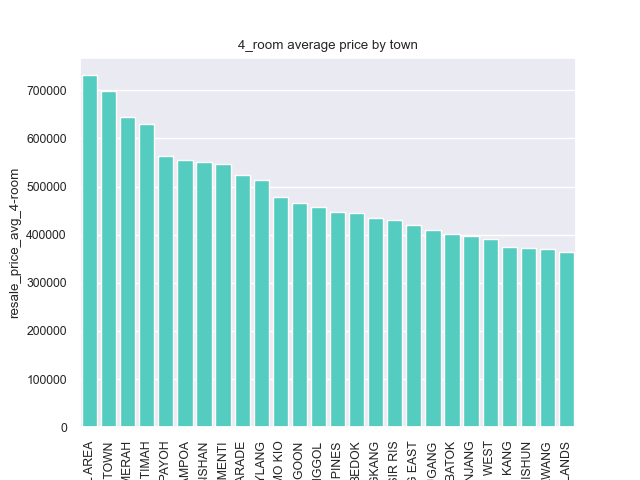

# Project - Singapore Housing Data

## Introduction
In this project we examine the HDB resale prices over a period of time 2012 - 2021. The results will be presented to the buyers and sellers in the HDB market. 

Both buyers and sellers would be able to guage the market conditions and the succesfully predicted values to negotiate and go for a win-win situation with the knowledge of the fundamental parameters underneath the price dynamics.

## Problem statement
What drives the HDB price in Singapore?

*success criteria:*  1) correctly identify the important paramters which drives the price. 2) predict the price within 50k sgd error.

*modelling:* We will use linear regression models to predict.

*Stakeholders:* Singapore home buyers and sellers

## Dataset
The dataset used for this study is obtained from the data.gov and curated by the kaggle challege organizers.

The dataset contains 72 features. The data dictionary is detailed in this page. [source](https://www.kaggle.com/competitions/dsi-sg-project-2-regression-challenge-hdb-price/data)

## Summary of analysis

Data cleaning and feature engineering was performed on the datasets.

Price of the HDB shows fluctuation across the years due to macroeconomic conditions and some government interventions to cool down the market [soure](https://www.mnd.gov.sg/newsroom/press-releases/view/measures-to-cool-the-property-market). As we know, the price of the properties would be affected by the type of housing, location and the size of the house. 

Here are some of the observations.

(1) HDB price trend across the years(4-room HDB)

- it is clear that the price is driven by the external market conditions. Interest rate and the global econonmy also plays a role in this phenomenon. This variation does not necessarily come from the HDB itself [source](https://www.mnd.gov.sg/newsroom/press-releases/view/measures-to-cool-the-property-market)

(2) HDB average price by town (4-room HDB)

- it is clearly observed that the location of the property is key driver in the property market. We have chosen 4-room flats only here to clearly show the trend. Some of the towns stand out from the rest due to various socio economic conditions [source](https://www.channelnewsasia.com/singapore/rents-increase-singapore-tenants-alternatives-3245521)

(3) HDB price across different floors. Here 4-room HDB in town = TOA PAYOH was chosen clearly show the trend.

(4) HDB price trend across w.r.t floor area

- floor area is a good driver along with other attributes of an HDB.

Overview of the interdependicies of the various features are shown in the following correlation plot aft making several feature engineering.

plot.png)

- this correlation plot shows that the feautres have significantly improved before the modelling. Obvious correlation with '1' value were removed.

## Modelling

Linear regression is utilized in this project. Given the nature of prediction - that is the price prediction, linear regression can be used as a simple and effective solution. 

Three modeling techniques were analised, namely Linear Regression, Ridge Regression and Lasso Regression. The modelling parameter summary is provided below.

The model summary is as follows. 
|Model|Cross validation score|R2 score|RMSE score|
|:----|:----|:----|:----|
|Linear_Regression|-5.04E+17|train: 0.8916|train: 47237|
| | |test: 0.8916|test:46996|
|Ridge_Regression|0.8913|train: 0.8916|train: 47237|
| | |test: 0.8916|test: 46996|
|Lasso_Regression|0.8858|train: 0.8916|train: 48420|
| | |test: 0.8915|test: 48283|

From the important metric of R2 score, we can see that the train and the test shows very close values. It can be understood as the model efficiency is already high in the regular linear regression. And further tuning does not give any sigficant modification.

RMSE also shows close values for all three models.

Based on the metrics, Linear regression and Lasso show good metrics. Ridge and Lasso would have improved the fitting parameters if the feature engineering was not sufficient.

The  predicted y_hat values against the y_true is shown below. The model shows acceptable trend.

The higheest coffients from the Lasso model is shown below. This model correctly captures the parameters driving the HDB price. We already know that the location is a primary reason. We also see floor_area_sqm showing up in the top hits. We already know that the floor area is a key driver. The age of the unit is reflected in the "lease_commence_date". 
We also see that the number of Hawkers in 2km radius "Hawker_Within_2km" is also captured.

| |variable|coef|abs_coef|
|:----|:----|:----|:----|
|1|town_MARINE PARADE|212527.1034|212527.1034|
|2|full_flat_type_3 ROOM Terrace|186194.684|186194.684|
|3|town_BUKIT TIMAH|155297.2864|155297.2864|
|4|floor_area_sqm|100666.7736|100666.7736|
|5|full_flat_type_5 ROOM DBSS|97029.91571|97029.91571|
|6|town_WOODLANDS|-83864.1993|83864.1993|
|7|town_SEMBAWANG|-83775.04855|83775.04855|
|8|town_BISHAN|83299.11336|83299.11336|
|9|town_SERANGOON|64087.52116|64087.52116|
|10|town_QUEENSTOWN|62543.42279|62543.42279|
|11|town_CHOA CHU KANG|-57685.52417|57685.52417|
|12|full_flat_type_4 ROOM DBSS|52624.7207|52624.7207|
|13|town_BUKIT PANJANG|-52576.75878|52576.75878|
|14|town_JURONG WEST|-52175.72878|52175.72878|
|15|town_CLEMENTI|49737.74824|49737.74824|
|16|lease_commence_date|49700.53667|49700.53667|
|17|full_flat_type_5 ROOM Model A|-39583.18046|39583.18046|
|18|full_flat_type_5 ROOM Type S2|38671.88564|38671.88564|
|19|Hawker_Within_2km|30258.25091|30258.25091|
|20|full_flat_type_4 ROOM Model A|-29017.70638|29017.70638|

## Conclusion and recommendations

We have designed a model for HDB price prediction. Based on the metrics, it is performing well to capture the key drivers of the HDB price.

The key drivers are:
1) location & type of flat
2) floor area
3) number of hawker centers nearby 
4) Age of the house.

Recommendations:
1) Based on our findings we recommend that the buyers and sellers use this model to gauge the price of the HDB for a smooth negotiations. Also need to consider the macro econcomic conditions. The RMSE values are within +/-50k sgd.

Future work:
Due to the processing power of the PC, we limited the 'object' class columns in our modelling. We can further improve the estimator with adding the following:
1) macro economic indicators 
2) Other key resources for quality living - hospitals and parks.

