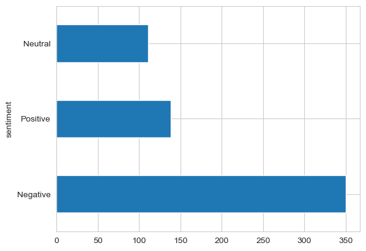
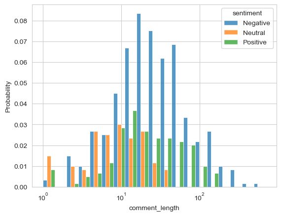
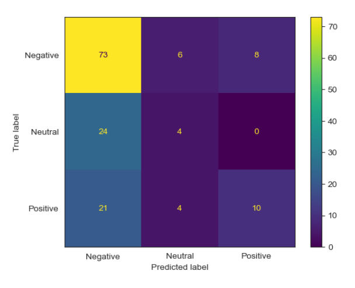

# Sentiment analysis on death penalty in Singapore

### Introduction

Singapore has a strict stance on drug trafficking and drug consumption, and that intentional murder and trafficking of significant quantities of drugs could lead to capital punishment. A recent death penalty case for drug trafficking has brought international attention and sparked discussions within the island and globally, with some expressing disapproval of Singapore's approach and labeling it as draconian. [link here]("https://www.mha.gov.sg/home-team-real-deal/detail/detail/the-death-penalty-in-singapore")

The Singapore government gauges public opinion on this topic frequently, but the latest study or survey predates the recent high-profile individual, Mr. Tangaraju Suppiah, who was executed for drug trafficking. Therefore, it is important to conduct a new study to understand the latest public sentiment on this issue, given the ever-changing landscape of drug trafficking and capital punishment in Singapore. [link here]("https://www.mha.gov.sg/mediaroom/press-releases/findings-from-recent-studies-on-the-death-penalty-in-singapore")

### Problem statement

#### *Research question:*
**What is the public opinion on death penalty in Singapore based on the recent execution?**

#### *Success criteria:*
1. Classify public sentiment on this topic  – Positive, Negative and Neutral. 
2. Focus analysis  on local Singapore sentiments on the topic

#### *Stakeholders:*
1. Primary stakeholders: Singapore public sector policy makers
2. Secondary stakeholders: Informed citizens of Singapore

### Dataset
In this section, we will describe how the data is collected for this NKP project to analyse sentiment on death penalty in Singapore.

#### Data collection

1. Data is extracted from reddits using API (praw package). [link here]("https://www.reddit.com/r/redditdev/comments/5hzkpr/using_praw_to_search_posts_on_reddit_works_for")
2. Data collection is focused in the Singapore context by restricting the search to relevant subreddits.
subreddits = ['Singapore', 'SingaporeRaw', 'asksingapore', 'trees']

3. Extracted comments were organized into a DataFrame for analysis

Compiled data dictionary from the scraped data is provided below.

|Column|Description|
|:----|:----|
|date|Date of comment/ reply|
|sub_id|ID of the subreddit|
|title|title of the subreddit|
|comment_id|ID of the comment|
|comment_author|Author of the comment|
|comment_text|Main text of the comment|
|upvote_score|Upvote score from the members|
|comment_or_reply|Identifier for comment or reply|
|sentiment|Sentiment of the comment_text using Vader pretrained model| 

Table: Algorithm score from the gridsearchcv with the best parameter fit on the train data.

###  EDA and data processing summary

1. Majority of comments had a negative sentiment.
2. The data range of the reddit posts was 22 Apr to 26 Apr when this topic was hot.
3. The sentiment showed a correlation on the comments length, ie. longer comments tend to show negative comments and shorter comments tend to be neutral comments

  
Figure: Bar chart shows the distribution of the sentiment. 

 
Figure: Histogram showing the distribution of the wordcounts per comment with respect to the sentiment.

### Preprocessing of data

The following preprocessing steps were applied to make the pretext comments suitable for modelling.
1. Comments that were ‘[deleted]’ and ‘[removed]’ were excluded
2. Regex was used to remove punctuations and hyperlinks
3. Standard NLP data preparation steps were applied:
    1. Tokenization and removal of stop words
    2. Lemmatizing
    3. Stemming
    
 
### Modelling

The following models were explored to predict the sentiment.
1. Naive Bayes
2. Random Forest
3. KNNeighbors

Grid search was used for hyperparameter tuning and model selection. Best model was chosen using AUC ROC metric as the sentiment distribution was imbalanced.

Random Forest algorithm showed the best overall AUC ROC score from the gridsearch.

#### Metric selection discussion

As this is a multilabel challenge AUC ROC is a suitable metric for multilabel challenge.
[Link here](https://scikit-learn.org/stable/modules/model_evaluation.html#multi-class-case) and [Link here](https://towardsdatascience.com/comprehensive-guide-on-multiclass-classification-metrics-af94cfb83fbd)

|Algorithm|AUC ROC|
|:----|:----|
|Naive Bayes|0.73|
|Random Forest|0.75|
|KNNeighbors|0.66| 

Table: Algorithm score from the gridsearchcv with the best parameter fit on the train data.

#### Results on the best model

The best model among the three models was chosen for further evaluation.

The confusion metrix is shown below for the RandomForest with the best parametric conditions.

 

### Conclusion 

- More than 50% the comments exhibited negative sentiments towards the death penalty

- Our multiclass machine learning model had a good ability to identify the negative sentiments, however, needs further improvement to enhance its performance

### Future work
- **More data:**   
In this project we scrapped data from the reddit. We could add other sources such as Facebook, Twitter, Youtube and other news outless to increase the datasets to improve the model performance. 

- **Improve stop words**  
Clean data is always good. We can include Singaporean English words to the stopword list and improve the quality of the fittings

- **Multi-predictor**  
We collected more predictors. However, we need to build custom transformers to perform multi-predictor analysis.

