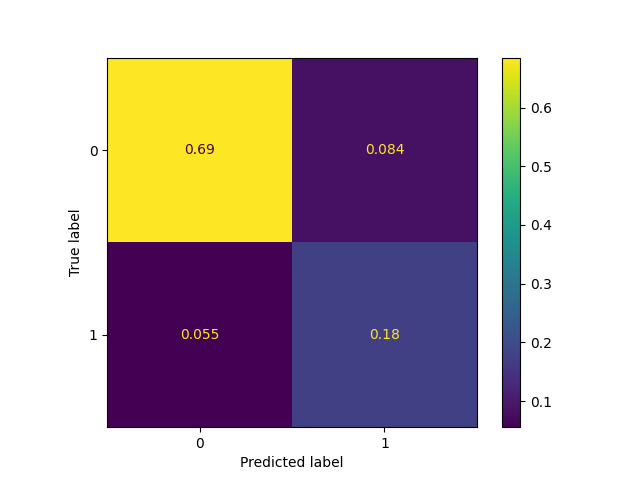
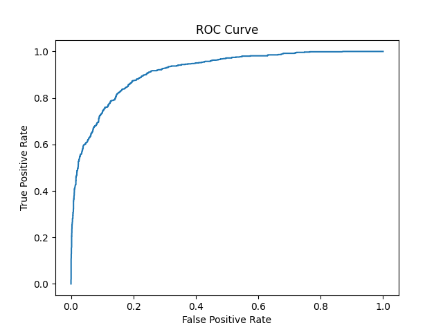

## Project: Predicting rain tomorrow!

## Background

Weather prediction is a complex and challenging task, as weather patterns are affected by many variables and can change rapidly. Typically, businesses and individuals rely on weather forecasts from popular outlets which provide a generic outlook. Fishing companies would be directly impacted by the extreme weather conditions. Inaccuracy in weather predictions could negatively impact such businesses. If the businesses venture into storms, there will be loss of assets and incur higher costs of maintenance. On the other hand, staying back due to inaccurate forecast would result in loss of business to the competitiors. 

In this project, we will explore machine learning models to address this business problem of predicting the weather with higher precision using the weather parameters provided.

## Problem Statement

**Predict whether it will rain tomorrow or not!**

As an AI engineer for a shipping company, the task is to develop a machine learning model that can predict whether it will rain tomorrow or not. The shipping company needs this information to plan their operations and ensure safe and timely delivery of goods and services.

## Executive Summary

#### Context and Motivation

A fishing company is in a difficult situation due to inaccurate weather forecasts.

If their ships go out to sea during a storm or rough weather, it could result in the loss of assets and higher maintenance costs. 

On the other hand, if the ships stay back because of an incorrect forecast, the company would lose income and market share to competitors. 

Therefore, the objective is to build a robust model that can improve both scenarios. The model should aim to increase the accuracy of predictions while reducing incorrect predictions.

#### Primary and Secondary Stakeholders
Primary - Fishing company who has assets to venture into the sea.

## Data Science Process
The data for this project is used from AISG database along with the data dictionary.

**1. Data processing and cleaning**

The dataset has ~ 13k rows and 21 columns. Even though the provided data is clean, we need to review the data to check which columns can be dropped, based on the data dictionary provided. 
- Examine the Null values and explore appropriate methods to impute them without impacting the data integrity.
- The criteria for dropping columns will be based on whether the features have higher correlation and/ or related information, which could cause multicollinearity.
- The review is also to see if additional feature engineering is required. For example, splitting date to year and month. 

**2. Exploratory Data Analysis**  

This section involves visualisation of the data in the form of graphs and other images. The dimensions looked at are as follows:
* Correlation plot to check for the correlation of the columns.
* Plots to visualize how Rainfall is influenced by the leading correlated paraemters.
* Rainfall plots which is correlated to target variable with respect to seasonality. Eg, plotting by the months.

The section also involves the feature selection to be used for modeling.

**3. Model Selection**

Target variable is "RainTommorow" which is predicted to be 'yes' or 'no'. This is a binary classification problem. 

The performance of the model for a classification problem can be evaluated using accuracy, precision, recall, F1 score, and ROC curve will be used to train and evalute the model.

For this project, we will use AUC-ROC metric instead of accuracy to choose the right model for the following reasons.

- The target variable is imbalanced
- We need to find the sweet spot that minimises false positives and false negatives as both have a financial impact to the company

The models that will be evaluated based on AUC-ROC scores are:
* **Logistic regression (Baseline model)**
    - Logistic regression is a simple and interpretable algorithm. Some of our features show linear correlation.
* **K-nearest neighbors (KNN)**
    - KNN is known for its its simplicity, non-parametric nature, and robustness.
* **Random forest classifier**
    -  a tree-based ensemble learning algorithm. Its high accuracy, robustness, and ability to handle both linear and non-linear relationships make it a good choice 
* **XGBoost**
    -  XGBoost high accuracy, speed, regularization techniques, and has then ability to handle both linear and non-linear relationships.

We do **hyperparameter tuning** using the grid search.

**4. Threshold tuning**

Once the candidate model is chosen, we need to identify the right  decision threshold that can provide an optimum balance between false positives and false negatives. One way is to choose the threshold that maximises the geometric mean of sensitivity and specificity. However, for this project, as the dataset is imbalanced, we may end up with a lot of false positives resulting in a low precision. So, we will identify the right threhold that maximises F1 score that provides a balance between precision and recall.

## Results and insights

Here's the summary of the hyperparameter tuning results using scoring='roc_auc'.

|Algorithm name|Best CV-score|
|:----|:----|
|LogisticRegression|0.905|
|RandomForest|0.922|
|XGBoost Best|0.919|
|KNNeighbors|0.896|

Based on the results obtained from the models, the RandomForest model was found to be the best performing one and is therefore chosen for further discussion.

|Item|Value|
|:----|:----|
|AUC score |0.915|
|F-Score|0.716|
|Best Threshold based on F1-score|0.352|

* **AUC score:**  
The AUC (area under the curve) of the ROC curve is a measure of the overall performance of the predictor. A perfect classifier would have an AUC of 1, while a random guess would have an AUC of 0.5. An AUC value of 0.915 indicates that the classifier has a high degree of accuracy in distinguishing between the positive and negative classes.

* **F-Score** 
A high F-score indicates that the model has high precision and high recall, and is often used as a metric for comparing the performance of different models. In general, a model with a higher F-score is preferred, as it indicates that the model is better at correctly classifying both positive and negative instances.

* **Best Threshold based on F1-score** 
Once the optimal threshold is found, it can be used to make predictions on new data. Any predicted probability above the threshold will be classified as positive, and any predicted probability below the threshold will be classified as negative.

**Confusion Matrix**

The confusion matrix for the optimal model, RandomForest is shown below.

Figure: Confusion Matrix for RandomForest algorithm.  

Figure: ROC curve for RandomForest algorithm.  

## Folder structure 

The folder structure is shown as below. 

    end-to-end-project_rainfall_prediction/
    ├── .github/
    ├── data/
    ├── env/
    ├── output/
    ├── report_data/
    ├── src/
    │   ├── main.py
    │   ├── data_cleaning.py
    │   └── ...
    ├── eda.ipynb
    ├── README.md
    ├── requirements.txt
    └── run.sh

### How to run the code

To run the code
1) Clone the repository.
2) Create a new python virtual environment and install requirements.txt. 

python -m venv env
pip install -r requirements.txt

3) Run the file run.sh

## Future work 

- As weather is a time-dependent phenomenon, it can be better predicted using a time-series-based approach that considers correlated data.

 - In this project, we approached the problem as a 'binary classification' task. However, we can extend our study to a 'multi-output' classification by treating the output for each location separately.
